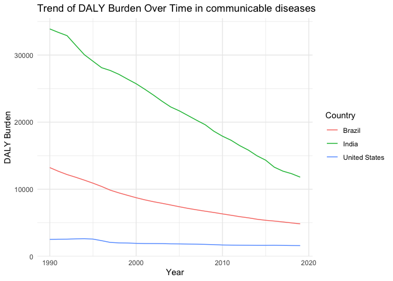
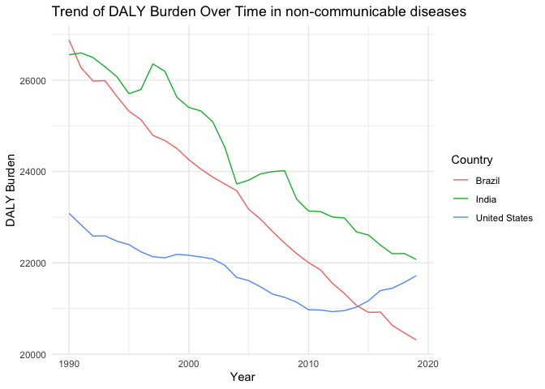
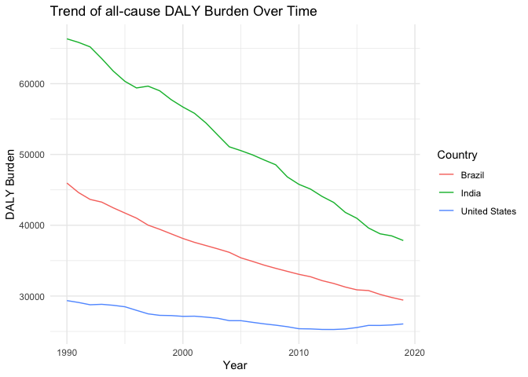

Global Disease Burden Analysis
================
Giulia Hofer

# Introduction

This document compares the Disability-Adjusted Life Year (DALY) diseases
burden for three countries: United States, Brazil, and India. We compare
the burden due to communicable, maternal, neonatal, and nutritional
diseases (CMNN), non-communicable diseases (NCDs), and overall disease
burden for these countries.

The source data is from the Institute for Health Metrics and Evaluation
(IHME) Global Burden of Disease (GBD) study.

# Communicable, Maternal, Neonatal, and Nutritional Disease Burden (CMNN)

## Table of Estimates for CMNN Burden Over Time

| Year |    Brazil |    India | United States |
|-----:|----------:|---------:|--------------:|
| 1990 | 13225.128 | 33895.90 |      2524.475 |
| 1991 | 12673.758 | 33375.63 |      2546.315 |
| 1992 | 12185.614 | 32893.75 |      2555.518 |
| 1993 | 11785.299 | 31463.62 |      2600.491 |
| 1994 | 11354.494 | 30056.13 |      2625.271 |
| 1995 | 10902.863 | 29081.08 |      2566.224 |
| 1996 | 10412.660 | 28119.10 |      2331.411 |
| 1997 |  9862.100 | 27700.58 |      2073.101 |
| 1998 |  9455.976 | 27128.22 |      1998.776 |
| 1999 |  9092.276 | 26415.00 |      1980.913 |
| 2000 |  8735.082 | 25728.70 |      1932.382 |
| 2001 |  8419.143 | 24907.14 |      1904.670 |
| 2002 |  8141.936 | 24039.62 |      1899.930 |
| 2003 |  7902.076 | 23118.65 |      1890.275 |
| 2004 |  7649.297 | 22267.72 |      1861.106 |
| 2005 |  7389.195 | 21683.08 |      1850.020 |
| 2006 |  7144.881 | 20985.53 |      1824.688 |
| 2007 |  6929.458 | 20284.67 |      1807.625 |
| 2008 |  6724.427 | 19615.25 |      1778.939 |
| 2009 |  6531.678 | 18650.45 |      1740.023 |
| 2010 |  6320.505 | 17907.34 |      1685.302 |
| 2011 |  6118.744 | 17295.99 |      1668.154 |
| 2012 |  5908.903 | 16497.53 |      1653.645 |
| 2013 |  5735.977 | 15829.94 |      1645.378 |
| 2014 |  5524.620 | 14983.53 |      1633.387 |
| 2015 |  5370.292 | 14332.53 |      1631.732 |
| 2016 |  5254.790 | 13288.66 |      1641.419 |
| 2017 |  5122.277 | 12696.29 |      1623.965 |
| 2018 |  4979.530 | 12319.55 |      1605.486 |
| 2019 |  4838.168 | 11801.44 |      1597.437 |

## Plot Showing Trends in CMNN Burden Over Time

<!-- -->

## Summary of CMNN Burden Findings

The chart shows a consistent decline in the DALY burden from
communicable diseases over time in India, indicating substantial
improvements in managing these diseases. Brazil’s DALY burden is also
decreasing, albeit at a slower rate than India’s. Meanwhile, the United
States displays a relatively flat trend, suggesting a stable and low
DALY burden from communicable diseases throughout the period. This may
reflect the impact of sustained public health efforts and healthcare
advancements in these regions.

# Non-Communicable Disease Burden (NCD)

## Table of Estimates for NCD Burden Over Time

| Year |   Brazil |    India | United States |
|-----:|---------:|---------:|--------------:|
| 1990 | 26878.18 | 26554.09 |      23081.31 |
| 1991 | 26274.16 | 26596.63 |      22833.05 |
| 1992 | 25980.82 | 26494.62 |      22584.36 |
| 1993 | 25987.45 | 26294.26 |      22590.01 |
| 1994 | 25642.50 | 26072.98 |      22473.41 |
| 1995 | 25320.93 | 25704.34 |      22397.64 |
| 1996 | 25135.56 | 25794.08 |      22240.05 |
| 1997 | 24790.31 | 26355.52 |      22133.33 |
| 1998 | 24678.36 | 26193.81 |      22108.63 |
| 1999 | 24505.38 | 25628.72 |      22184.93 |
| 2000 | 24259.14 | 25402.28 |      22163.83 |
| 2001 | 24054.18 | 25326.27 |      22127.69 |
| 2002 | 23876.85 | 25087.93 |      22084.70 |
| 2003 | 23726.83 | 24536.36 |      21947.19 |
| 2004 | 23577.01 | 23726.90 |      21678.45 |
| 2005 | 23171.79 | 23809.74 |      21610.67 |
| 2006 | 22954.68 | 23947.92 |      21472.44 |
| 2007 | 22684.44 | 23997.51 |      21314.34 |
| 2008 | 22432.92 | 24014.73 |      21243.82 |
| 2009 | 22202.47 | 23396.45 |      21138.27 |
| 2010 | 22005.03 | 23134.68 |      20971.39 |
| 2011 | 21845.06 | 23120.89 |      20965.11 |
| 2012 | 21549.33 | 23002.85 |      20930.28 |
| 2013 | 21327.61 | 22981.07 |      20952.17 |
| 2014 | 21068.12 | 22676.67 |      21027.65 |
| 2015 | 20914.63 | 22608.59 |      21166.86 |
| 2016 | 20920.49 | 22389.00 |      21390.44 |
| 2017 | 20629.32 | 22197.81 |      21443.21 |
| 2018 | 20465.81 | 22204.26 |      21569.41 |
| 2019 | 20309.17 | 22071.57 |      21717.37 |

## Plot Showing Trends in NCD Burden Over Time

<!-- -->

## Summary of NCD Burden Findings

Based on the chart presented, there is a clear downward trend in DALY
burden for both Brazil and India over the time period shown. The United
States, however, exhibits a different pattern, with a decrease in DALY
burden until around 2010, followed by a period of fluctuation and an
upward trend in recent years. This could indicate an improvement in
health outcomes or health interventions in Brazil and India, while the
situation in the United States may require further investigation to
understand the causes behind the increasing DALY burden.

# Overall Disease Burden

## Table of Estimates for Overall Disease Burden Over Time

| Year |   Brazil |    India | United States |
|-----:|---------:|---------:|--------------:|
| 1990 | 45962.15 | 66331.86 |      29357.02 |
| 1991 | 44620.25 | 65830.74 |      29093.36 |
| 1992 | 43648.84 | 65195.09 |      28767.75 |
| 1993 | 43268.12 | 63540.49 |      28832.78 |
| 1994 | 42456.26 | 61770.56 |      28691.94 |
| 1995 | 41727.34 | 60328.05 |      28487.07 |
| 1996 | 41005.87 | 59392.84 |      27981.23 |
| 1997 | 40014.81 | 59647.16 |      27486.15 |
| 1998 | 39427.12 | 58990.25 |      27273.42 |
| 1999 | 38776.75 | 57725.99 |      27241.14 |
| 2000 | 38131.24 | 56700.43 |      27132.50 |
| 2001 | 37583.18 | 55810.22 |      27154.76 |
| 2002 | 37126.16 | 54426.49 |      27023.56 |
| 2003 | 36664.31 | 52742.33 |      26861.34 |
| 2004 | 36173.63 | 51078.22 |      26523.14 |
| 2005 | 35395.81 | 50537.78 |      26521.03 |
| 2006 | 34895.73 | 49940.44 |      26289.37 |
| 2007 | 34368.23 | 49223.80 |      26070.69 |
| 2008 | 33913.99 | 48542.66 |      25886.82 |
| 2009 | 33487.78 | 46831.44 |      25668.67 |
| 2010 | 33067.23 | 45779.16 |      25383.77 |
| 2011 | 32726.92 | 45108.60 |      25356.41 |
| 2012 | 32177.95 | 44068.44 |      25281.31 |
| 2013 | 31776.73 | 43223.26 |      25275.79 |
| 2014 | 31271.43 | 41814.78 |      25346.71 |
| 2015 | 30873.99 | 40978.04 |      25552.85 |
| 2016 | 30776.76 | 39614.92 |      25854.39 |
| 2017 | 30229.88 | 38790.55 |      25847.77 |
| 2018 | 29798.11 | 38497.58 |      25914.99 |
| 2019 | 29427.39 | 37843.33 |      26061.04 |

## Plot Showing Trends in Overall Disease Burden Over Time

<!-- -->

## Summary of Overall Disease Burden Findings

The chart indicates a significant decrease in the all-cause DALY burden
over time for India, showing a strong positive trend in overall health
or effectiveness of health interventions. Brazil also shows a declining
trend, but with a less steep slope than India, suggesting slower
progress. The United States exhibits the lowest DALY burden of the three
and maintains a relatively stable level over the years, possibly
reflecting an established healthcare system effectively managing the
overall health burden.
